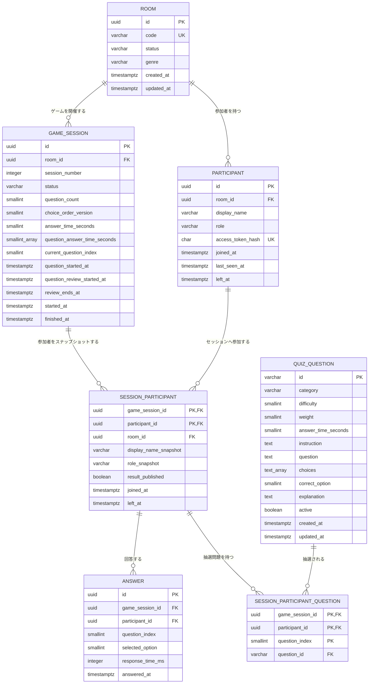

# データベースER図

## 今回の変更

問題のDB管理と参加者別のランダム出題のため、次の2テーブルを追加しました。

- `quiz_question`: 問題本文、難易度、選択肢、正解、制限時間を持つ問題マスタ
- `session_participant_question`: セッション参加者ごとに抽選された24問と出題順を固定する中間テーブル

`session_participant_question`は`session_participant`の複合主キーを参照するため、同じセッションでも
参加者ごとに異なる問題構成を保持できます。`question_index`は0〜23で、同じ参加者に同じ問題を
重複して割り当てることはできません。

## 現在のER図

`schema_migrations`はマイグレーション管理用テーブルのため、このドメインER図からは省略しています。
