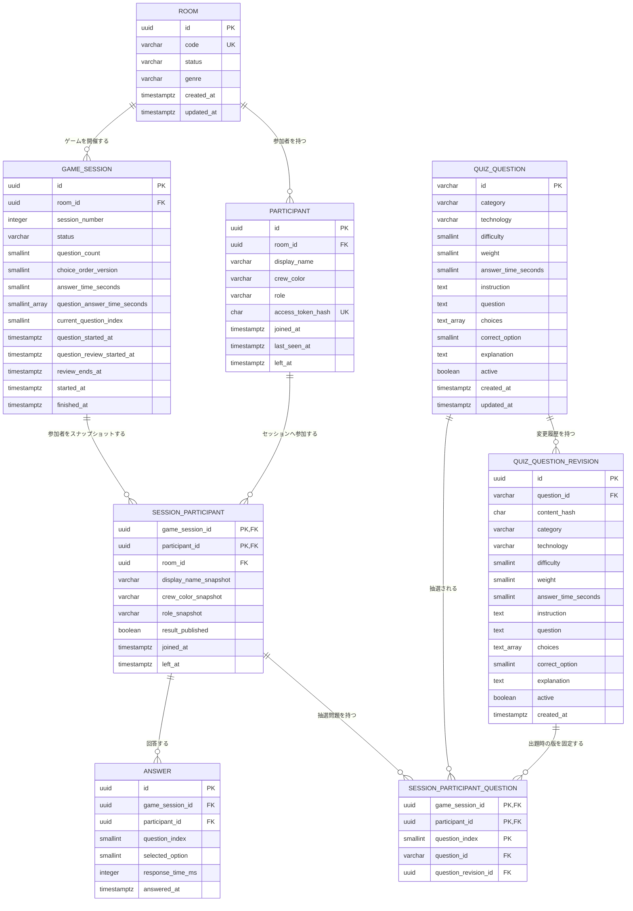

# データベースER図

## 問題・参加者メタデータ

問題のDB管理と参加者別のランダム出題のため、次の2テーブルを追加しました。

- `quiz_question`: 問題本文、難易度、選択肢、正解、制限時間を持つ問題マスタ
- `session_participant_question`: セッション参加者ごとに抽選された24問と出題順を固定する中間テーブル

`session_participant_question`は`session_participant`の複合主キーを参照するため、同じセッションでも
参加者ごとに異なる問題構成を保持できます。`question_index`は0〜23で、同じ参加者に同じ問題を
重複して割り当てることはできません。

問題の表示対象技術・言語は`quiz_question.technology`へ保存します。クルーカラーは
`participant.crew_color`へ保存し、ゲーム開始時の値を`session_participant.crew_color_snapshot`へ
複製します。これにより、将来参加者の色を変更できるようになっても過去セッションの表示を再現できます。

## 現在のER図

`schema_migrations`はマイグレーション管理用テーブルのため、このドメインER図からは省略しています。
